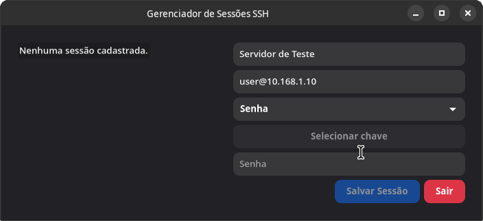
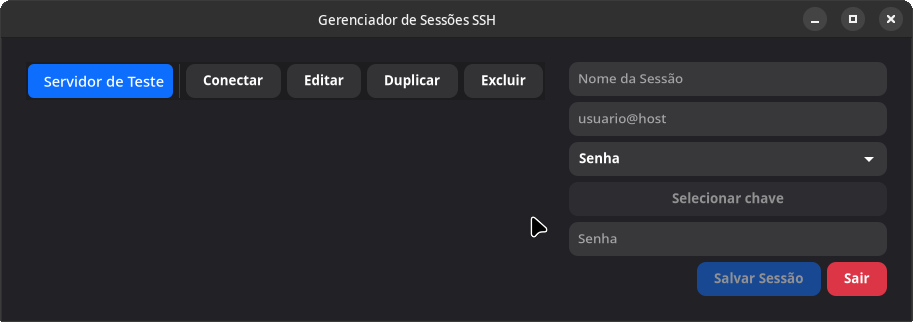

# 🔐 SSH Session Manager (GTK 4 + Adwaita)

A simple and functional graphical SSH session manager built with **Python**, **GTK 4**, and **LibAdwaita**. It allows you to easily save, edit, duplicate, and remove SSH connections, with support for authentication via **private key** or **password**.

---

## ✨ Features

- 💾 Save SSH connections with a friendly name
- 🔑 Support for authentication via private key or password
- 📋 Session listing with buttons for:
  - 🔄 **Duplicate**
  - ✏️ **Edit**
  - 🚀 **Connect**
  - ❌ **Delete**
- ✅ Confirmation before deleting or duplicating sessions
- 🧩 Modern interface using Adwaita and GTK 4
- 🗂️ Local session storage in `~/.config/ssh-manager/sessions.json`
- 🛡️ Password stored in base64 (for obfuscation)

---

## 🖼️ Screenshot








---

## 💻 Requirements

### BigLinux / BigCommunity / Arch Linux / Manjaro

```bash
sudo pacman -S gtk4 libadwaita python-gobject terminator sshpass
```

# 🔒 Security

- ⚠️ **Warning**: Passwords are stored in **base64**, which only **obfuscates** the content — it is **not secure** for critical environments.
- 🔐 For greater security, prefer using a **private key** whenever possible.
- 🧠 The project can be easily adapted to encrypt passwords using libraries such as `cryptography` or `gnupg`.

---

## 👨‍💻 Author

Developed by **Leoberbert**

- 🌐 [linkedin.com/in/leoberbert](https://linkedin.com/in/leoberbert)
- 💻 GitHub: [github.com/leoberbert](https://github.com/leoberbert)

---

## 📝 License

This project is licensed under the **MIT License**.

📄 See the full license content in the [LICENSE](LICENSE) file.